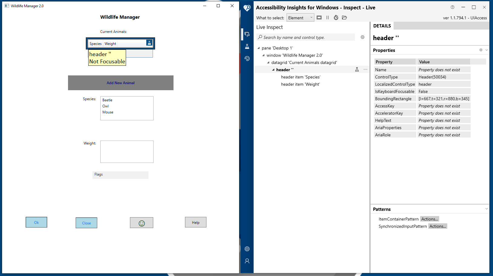
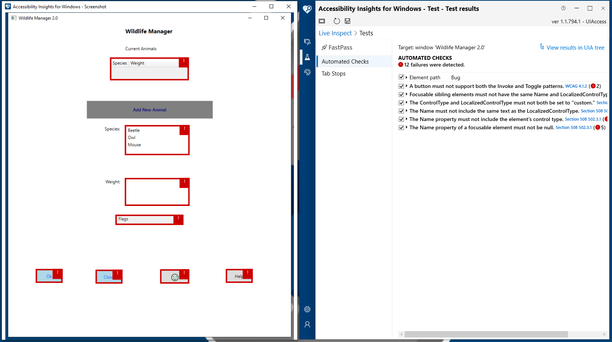
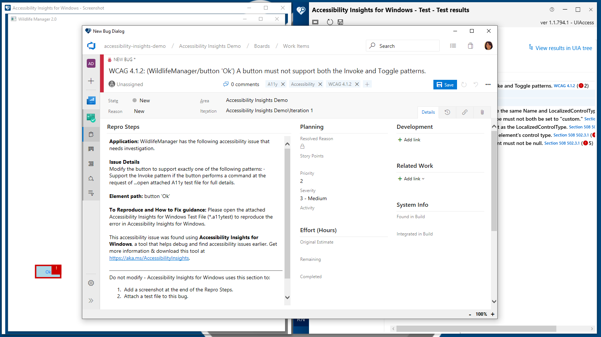
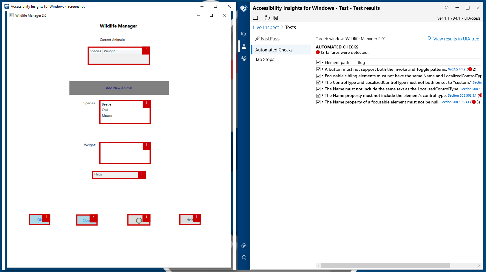

## March 2019 Release ([v1.1.0794.01](https://github.com/Microsoft/accessibility-insights-windows/releases/tag/v1.1.0794.01))

<a href="https://aka.ms/accessibilityinsights-windows/download" target="_blank">Download for Windows</a>

Welcome to the March 2019 release of Accessibility Insights for Windows. Key highlights include:

- [**Verify an element has the expected UI Automation properties**](#verify-an-element-has-the-expected-ui-automation-properties): Inspect the live UI Automation tree using Live Inspect.
- [**Quickly find accessibility issues with FastPass**](#quickly-find-accessibility-issues-with-fastpass): FastPass is a lightweight, two-step process that helps developers identify common, high-impact accessibility issues in less than 5 minutes.
- [**File bugs**](#file-bugs): Can't fix a bug right now? Log the bug in Azure Boards, complete with a snapshot file.
- [**Check color contrast**](#check-color-contrast): Identify accessibility issues caused by low color contrast using the Color Contrast Analyzer.

In the following samples, we are testing an app called "Wildlife Manager". 

### Verify an element has the expected UI Automation properties

Inspect enables you to easily verify that a UI element in a Windows app:

- Has the expected UI Automation properties
- Supports the expected control patterns
- Responds as expected to user input
- Generates the expected events

[Learn more about Inspect](https://go.microsoft.com/fwlink/?linkid=2075123).

### Quickly find accessibility issues with FastPass

FastPass is a lightweight, _two-step_ process that helps developers identify common, high-impact accessibility issues in less than five minutes.

1. **Automated checks** - the tool automatically checks for compliance with dozens of accessibility rules.
1. **Manual test for tab stops** - the tool provides clear instructions and a visual helper that makes it easy to identify critical accessibility issues related to keyboard access, such as missing tab stops, keyboard traps, and incorrect tab order.

We recommend developers run a FastPass before every check-in of UI code.

[Learn more about FastPass](https://go.microsoft.com/fwlink/?linkid=2075125).

### File bugs

Can't fix a bug right now? File the bug in Azure Boards, complete with a snapshot file. You and your collaborators can load the snapshot file in Accessibility Insights for Windows to review the issue at a later time.

[Learn more about Bug filing](https://go.microsoft.com/fwlink/?linkid=2075269).

### Check color contrast

The Color Contrast Analyzer helps developers investigate contrast ratios. You can either automatically detect the contrast ratio, or manually select the foreground and background colors to test the contrast ratio.

[Learn more about Color contrast](https://go.microsoft.com/fwlink/?linkid=2075365).
